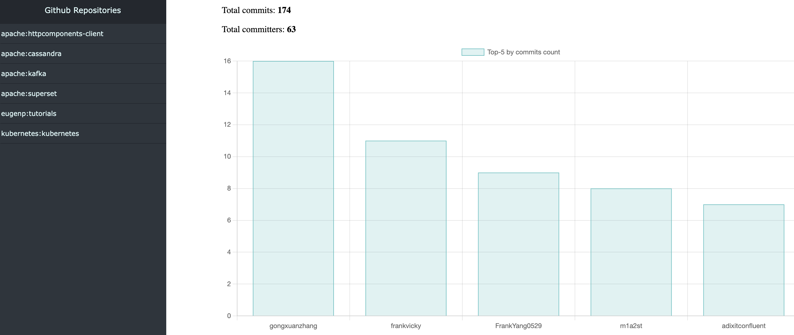
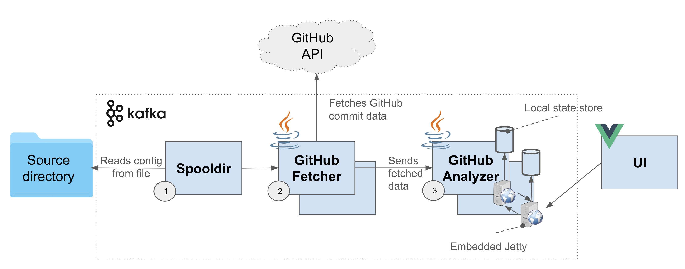

## Kafka GitHub statistics
This is the pet project on Kafka Consumer / Producer / Connect / Streams.
- Application receives the FetchRequest by polling local filesystem
- Fetches data about commits from GitHub API according to the FetchRequest
- Calculates statistics based on the commit data
- Displays statistics:



### Architecture

1. Uses **Spooldir** - Kafka Connect ready-to-go component to poll data from the local 
filesystem
2. **GitHub Fetcher** is implemented as Kafka Consumer and Producer
3. **GitHub Analyzer** is a Kafka Streams application

All instances of GitHub Analyzer expose their local state store data via REST API with embedded Jetty server.

Frontend application request is redirected to the GitHub Analyzer app instance which actually
stores required data.
### Pre-requisites
- Java 11
- Docker
- Maven
- NPM
### Launch
- Launch: ./start.sh <your_GitHub_access_token*>
- Teardown: ./stop.sh

*Token can be found on GitHub website: 

Settings -> Developer Settings -> Personal access tokens

After launching, add .json files to **./directory_reader/sourcedir**

File example:
```json
[
  {
    "owner": "kubernetes",
    "repo": "kubernetes",
    "since": "2024-06-24"
  },
  {
    "owner": "eugenp",
    "repo": "tutorials",
    "since": "2024-06-20"
  }
]
```
- For provided GitHub repositories calculated statistics is available at
http://localhost:8082/

Statistics example:
- Total number of commits
- Total number of contributors
- Top-5 contributors and their commits count

Kafka UI is available at http://localhost:8080/